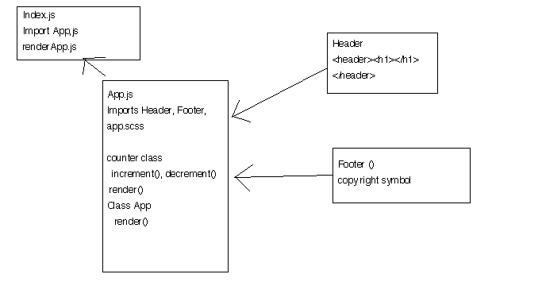

# LAB 27

## Project Name React Testing Deployment and Documentation

### Author: Student/Group Name: Ed

### Links and Resources
* [submission PR](https://github.com/yourname-401-advanced-javascript/lab-14/pull/1)
* [travis](https://travis-ci.com/EdDearment-401-advanced-javascript/lab-27/jobs/212842150)
* [front-end-AWS](http://clicky.s3-website-us-west-2.amazonaws.com)
* [front-end-Netlyfy](https://youthful-torvalds-f4cc39.netlify.com)

#### Documentation
* [styleguide](http://xyz.com) (React assignments)

### Setup
#### `.env` requirements
* SKIP_PREFLIGHT_CHECK=true

#### Running the app
* `npm start`
  
#### Tests
* How do you run tests?
npm run test
npm run lint

#### UML

